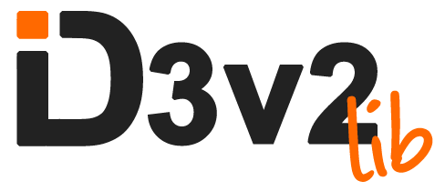

> Click [here](https://github.com/larsbs/id3v2lib/blob/d8c9f3ff27dbf82d8136550efd8de334d688e21e/README.md) to view the docs for version 1.0.

id3v2lib is a library written in C to read and edit id3 tags from mp3 files. It's focused on the ease of use.

It is licensed under a BSD License. See [LICENSE](LICENSE) for details.

## Table Of Contents

- [Table Of Contents](#table-of-contents)
- [What Can It Do?](#what-can-it-do-)
- [Building and Installing](#building-and-installing)
  * [Building Using GNU Make in UNIX Systems](#building-using-gnu-make-in-unix-systems)
  * [Building Using CMake](#building-using-cmake)
- [Usage](#usage)
- [API](#api)
  * [File Functions](#file-functions)
  * [Tag Functions](#tag-functions)
    + [Getter Functions](#getter-functions)
    + [Setter Functions](#setter-functions)
    + [Delete Functions](#delete-functions)
- [Examples](#examples)
    + [Load Tags](#load-tags)
    + [Edit Tags](#edit-tags)
    + [Delete Tags](#delete-tags)
- [Extending Functionality](#extending-functionality)
    + [Read New Frames](#read-new-frames)
    + [Edit New Frames](#edit-new-frames)
- [Compatibility Layer](#compatibility-layer)
- [Projects](#projects)
- [Copyright](#copyright)
- [Questions?](#questions-)

## What Can It Do?

id3v2lib can read and edit id3 v2.3 and v2.4 tags from mp3 files. However, it's not compatible with id3v1 tags. By default, it can read and edit a small subset of well known tags. Specifically:

* Title
* Album
* Artist
* Album Artist
* Comment
* Genre
* Year
* Track
* Disc Number
* Album Cover

However, the library can be extended in a very easy way, to read all the tags available.

## Building and Installing

### Building Using GNU Make in UNIX Systems

To build the library using Make, simply cd into the project's folder and run:

```bash
$ make
```

After the building step is finished, you'll find the compiled library inside the `lib` folder.

### Building Using CMake

It's possible to use CMake 3.1+ to build id3v2lib on most platforms. To build and install the library, navigate into the project's directory and then run the following commands:

```bash
$ mkdir build && cd build
$ cmake ..
$ cmake --build .
$ cmake --install .
```

It's possible that *su* privileges will be needed for the installation step.

> By default a **static version** of the library will be generated. However, If a shared library is required, the output library type can be easily toggled with `-DBUILD_SHARED_LIBS=ON` or `-DBUILD_SHARED_LIBS=OFF`

## Usage

Include the main header of the library:

```C
#include <id3v2lib.h>

int main(int argc, char* argv[])
{
  // Etc..
}
```

And then, link against the library during compilation:

```bash
$ gcc -o example example.c -lid3v2lib
```

## API

Every intended public facing function or type is prefixed with `ID3v2_` to help with autocompletion, prevent conflicts and make identifying wich functions belong to the public API and which functions belong to the internal API easier.

### File Functions

These functions interacts directly with the file to edit:

* `ID3v2_TagHeader* ID3v2_read_tag_header(const char* file_name)`
* `ID3v2_Tag* ID3v2_read_tag(const char* file_name)`
* `void ID3v2_write_tag(const char* file_name, ID3v2_Tag* Tag)`
* `void ID3v2_delete_tag(const char* file_name)`

Alternatively, there's another set of functions that will take a buffer as an argument instead of a file name in case that's preferred/needed:

 * `ID3v2_TagHeader* ID3v2_read_tag_header_from_buffer(const char* buffer)`
 * `ID3v2_Tag* ID3v2_read_tag_from_buffer(const char* buffer, const int size)`

### Tag Functions

These functions interacts with the different frames found in the tag. For the most used frames, a set of specific functions is provided. In case less known frames need to be manipulated, general purpose functions that interact with any frame id are also provided. More in the section about [extending functionality](extending_functionality).

#### Getter Functions

Retrieve information from a frame, they have the following name pattern:

* `ID3v2_Tag_get_[frame]_frame` where frame is the name of the desired frame to find. It can be one of the previously mentioned tags.

#### Setter Functions

Set new information in a frame, they have the following name pattern:

* `ID3v2_Tag_set_[frame]` where frame is the name of the desired frame to edit. It can be one of the previously mentioned tags.

#### Delete Functions

Delete frames from the tag, they have the following name pattern:

* `ID3v2_Tag_delete_[frame]` where frame is the name of the desired frame to delete. It can be one of the previously mentioned tags.

## Examples

For more examples, go to the [test](test) folder.

#### Load Tags

```C
ID3v2_tag* tag = ID3v2_read_tag("file.mp3"); // Load the full tag from the file

// Alternatively, the buffer version can be used
// ID3v2_Tag* tag = ID3v2_read_tag_from_buffer(buffer, size);

if(tag == NULL)
{
  tag = ID3v2_Tag_new();
}

// Read data from the tag
ID3v2_TextFrame* artist_frame = ID3v2_Tag_get_artist_frame(tag);
printf("artist: %s", artist_frame->text); // this only works if encoding = ISO

ID3v2_TextFrame* album_frame = ID3v2_Tag_get_album_frame(tag);
printf("album: %s", album_frame->text); // this only works if encoding = ISO
```

#### Edit Tags

```C
ID3v2_tag* tag = ID3v2_read_tag("file.mp3"); // Load the full tag from the file

// Alternatively, the buffer version can be used
// ID3v2_Tag* tag = ID3v2_read_tag_from_buffer(buffer, size);

if(tag == NULL)
{
  tag = ID3v2_Tag_new();
}

// Set the new info
ID3v2_Tag_set_title(tag, ID3v2_to_unicode("Title"));
ID3v2_Tag_set_artist(tag, ID3v2_to_unicode("Artist"));

// Write the updated tag to the file
ID3v2_write_tag("file.mp3", tag);
```

#### Delete Tags

```C
ID3v2_tag* tag = ID3v2_read_tag("file.mp3"); // Load the full tag from the file

// Alternatively, the buffer version can be used
// ID3v2_Tag* tag = ID3v2_read_tag_from_buffer(buffer, size);

if(tag == NULL)
{
  tag = ID3v2_Tag_new();
}

// We can delete single frames
ID3v2_Tag_delete_title(tag);
ID3v2_Tag_delete_artist(tag);

// Write the new tag to the file
ID3v2_write_tag("file.mp3", tag);

// Or we can delete the full tag
ID3v2_delete_tag("file.mp3")
```

## Extending Functionality

In case you need to read more esoteric frames than the ones provided by default, the library can be extended very easily to fit your needs.

#### Read New Frames

Suppose we want to read the frame that stores the copyright message (TCOP). We have to do the following:

```C
ID3v2_tag* tag = ID3v2_read_tag("file.mp3"); // Load the full tag from the file

// Alternatively, the buffer version can be used
// ID3v2_Tag* tag = ID3v2_read_tag_from_buffer(buffer, size);

if(tag == NULL)
{
  tag = ID3v2_Tag_new();
}

// That's it, the only extra bit necessary here is taking into account that TCOP is a
// text frame and we have to do the casting manually.
ID3v2_TextFrame* copyright_frame = (ID3v2_TextFrame*) ID3v2_Tag_get_frame(tag, "TCOP");
printf("copyright: %s", copyright_frame->text); // this only works if encoding = ISO
```

#### Edit New Frames

Suppose that now, we want to edit the copyright frame. We have to do the following:

```C
ID3v2_tag* tag = ID3v2_read_tag("file.mp3"); // Load the full tag from the file

// Alternatively, the buffer version can be used
// ID3v2_Tag* tag = ID3v2_read_tag_from_buffer(buffer, size);

if(tag == NULL)
{
  tag = ID3v2_Tag_new();
}

// Since TCOP is a text frame, we have to use the generic function that deals
// with text frames. There's another generic function to deal with comment frames
// and another one that deals with apic frames.
ID3v2_Tag_set_text_frame(tag, &(ID3v2_TextFrameInput) {
  .id = "TCOP",
  .flags = "\0\0",
  .text = "A copyright message"
});
```

## Compatibility Layer

In case you're not able to migrate your code to the new version of the library, a compatibility layer is provided that will make use of the new internals while presenting the old API. However, it's recommended that whenver possible, a full migration to the new API is done as the maintenance of this compatibility layer is not guarantee for future versions.

To use the compatibility layer simply include `id3v2lib.compat.h` instead of the regular one. This will allow you to keep using the old functions but using the revamped code internally.

```C
#include <id3v2lib.compat.h>

void main()
{
    ID3v2_tag* tag = load_tag("file.mp3");
    if (tag == NULL) tag = new_tag();

    ID3v2_frame* album_frame = tag_get_album(tag);
    ID3v2_frame_text_content* album_content = parse_text_frame_content(album_frame);
    printf("Album: %s", album_content->data);
}
```

## Projects

Is your project is using this library? Let me know it and I'll add it here!

## Copyright

Copyright (c) 2013 Lars Ruiz. See [LICENSE](LICENSE) for details.

## Questions?

If you have any questions or suggestions, please feel free to ask or raise an issue.
